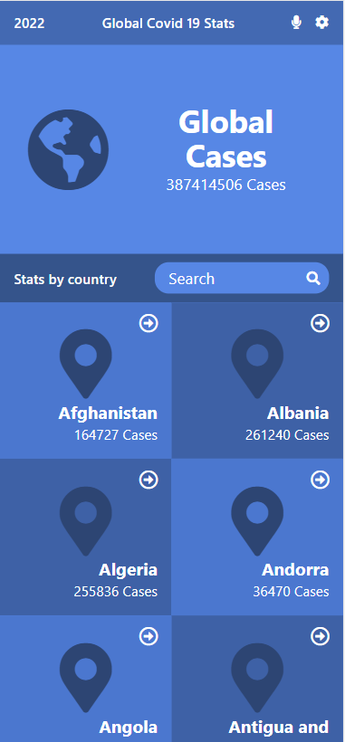
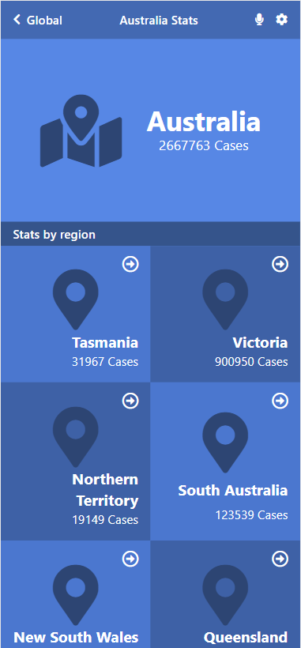

# Covid Stats

>This web app shows COVID 19 Daily stats and use Narrativa API to get this data and this site can show you:
> - Home page with global total confirmed cases and list of all countries with thier total cases too and I implemet search bar to filter countries that match your search.
> - Details or Rigion page when you click on any country on home page it directs you to this page whitch will show you all confermed cases for that country and regional cases data if found.

> This site is ingle page application (SPA) built using React and Redux and TailwindCSS for styling.

## Live Demo Link

Live Demo [Link](https://covid-stats-cap.netlify.app/)

## Live Video Demo

Live Video Demo [Link](https://www.loom.com/share/81fbd432771946f59feb5a152a00a7db)

## Site Screenshots

 

## Built With

- React.
- Redux
- JavaScript.
- HTML.
- CSS.
- TailwindCSS
- Webpack.
- Linters.

## Install

- Install node.js from [HERE](https://nodejs.org/en/).

## Test

- `Npm run test`
  
## Setup

1. Clone the project using git-bash or Githup Desktop.
2. Open the project folder with VSCode or any Editor.
3. Open terminal and navigate to the project folder.
4. Type `npm install`.
5. Type `npm start`.

## Authors

👨‍💻 **Omar Muhammad**

- GitHub: [@Omar-Muhamad](https://github.com/Omar-Muhamad)
- Twitter: [@Eng_OmarMuhamad](https://twitter.com/Eng_OmarMuhamad)
- LinkedIn: [@eng-omarmuhammad](https://www.linkedin.com/in/eng-omarmuhammad/)

## Acknowledgement
 Special thanks to:
- Narrativa I used their [API](https://covid19tracking.narrativa.com/index_en.html) to get app data.
- [Nelson Sakwa](https://www.behance.net/sakwadesignstudio) I used his [design](https://www.behance.net/gallery/31579789/Ballhead-App-(Free-PSDs)) to style my App.

## Show your support

Give a ⭐️ if you like this project!
## 📝 License

This project is [MIT](./MIT.md) licensed.
